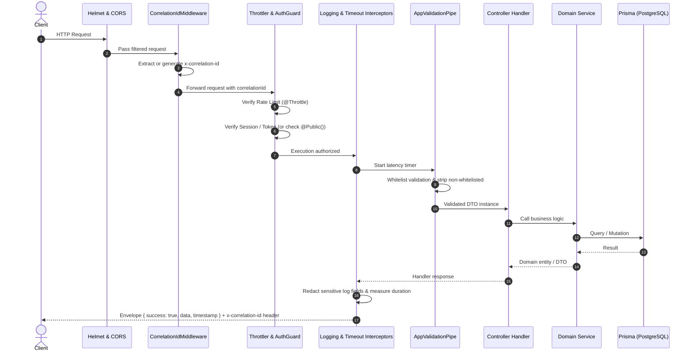

# System Architecture & Technical Design

This document details the architectural principles, layer topology, data flow, and design patterns established for the **Enterprise NestJS Starter Project**.

---

## 1. Architectural Philosophy

1. **Defense-in-Depth Security**: Security is the primary design pillar. Every layer—from reverse proxy to transport headers, rate limiting, authentication, input whitelisting, and output sanitization—enforces least privilege and information concealment.
2. **Modular Monolith**: Features are isolated into high-cohesion, low-coupling domain modules (`src/modules/*`). Cross-cutting infrastructure resides in `src/common` and `src/core`.
3. **Fail-Fast Configuration**: All environment variables are strictly validated at process bootstrap via [Zod](https://zod.dev). The application aborts immediately if required configuration or cryptographic keys are missing or invalid.
4. **Standardized Response Envelopes**: All API interactions return consistent, predictable JSON structures for both success and error scenarios.
5. **Observability & Traceability**: Every HTTP request is assigned a unique `x-correlation-id` that propagates across middleware, logging interceptors, database operations, and outbound responses.

---

## 2. Directory Topology

```
src/
├── app.module.ts              # Root composition root
├── main.ts                    # Bootstrap with Helmet, CORS, Swagger, Pipes
├── common/                    # Cross-cutting concerns
│   ├── constants/             # Shared tokens, header constants, redaction lists
│   ├── decorators/            # @Public(), @CurrentUser(), @CorrelationId()
│   ├── filters/               # HttpExceptionFilter (enterprise error sanitizer)
│   ├── interceptors/          # LoggingInterceptor, TransformInterceptor, TimeoutInterceptor
│   ├── middleware/            # CorrelationIdMiddleware
│   └── pipes/                 # AppValidationPipe (strict whitelist & reject unknown)
├── config/                    # Strictly typed, Zod-validated configuration namespaces
│   ├── app.config.ts          # Server host, port, API prefix, environment flags
│   ├── auth.config.ts         # Better-Auth secrets, URLs, and token TTLs
│   ├── database.config.ts     # PostgreSQL connection pool settings
│   ├── security.config.ts     # Throttling rate limits, CORS whitelist
│   └── env.validation.ts      # Zod validation schema executing at startup
├── core/                      # Singleton infrastructure
│   ├── database/              # PrismaService & PrismaModule (PostgreSQL)
│   └── health/                # Terminus liveness and readiness probes
└── modules/                   # Domain features
    ├── auth/                  # Better-Auth integration, AuthGuard, AuthController
    └── users/                 # Example domain: DTOs, entity, service, controller
```

---

## 3. Request Lifecycle



---

## 4. API Response Specifications

### Success Envelope
All successful requests are automatically transformed by `TransformInterceptor`:
```json
{
  "success": true,
  "statusCode": 200,
  "data": {
    "id": "cm123456789",
    "name": "Jane Developer",
    "email": "jane@example.com"
  },
  "timestamp": "2026-09-21T11:42:00.000Z"
}
```

### Error Envelope
All uncaught exceptions and HTTP errors are intercepted by `HttpExceptionFilter`. In production, internal database errors and stack traces are stripped:
```json
{
  "statusCode": 400,
  "timestamp": "2026-09-21T11:42:00.000Z",
  "path": "/api/v1/auth/login",
  "correlationId": "8f3b145a-c0e8-46c5-9c98-1e4383c38b29",
  "message": "Validation failed",
  "errors": [
    {
      "property": "email",
      "constraints": {
        "isEmail": "Please provide a valid email address"
      }
    }
  ]
}
```

---

## 5. Architectural Boundaries & Dependency Rules

1. **Modules must not import internal files of other modules directly**: Only import exported services and interfaces from the module's public entrypoint (`module-name.module.ts` or `index.ts`).
2. **Controllers are thin**: Controllers are strictly responsible for request decoding, Swagger annotations, HTTP status code mapping, and calling domain services.
3. **Database access only via `PrismaService`**: Raw database drivers or queries must not be scattered in controllers or utils.
4. **Zero circular dependencies**: Use NestJS `forwardRef()` only as an extreme last resort; prefer event emitters or domain services.
